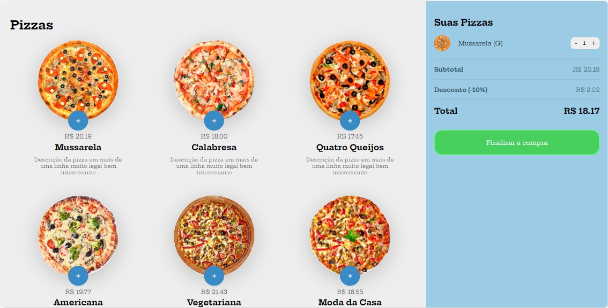

<h1 align="center">Projeto Compras de Pizzas</h1>

<p align="center">
Projeto realizado no Curso B7Web para ensino de tecnologias WEB.
<br>
Veja ele aqui > <a href="https://cassmach.github.io/CompraDePizzas-JS">https://cassmach.github.io/CompraDePizzas-JS</a>
</p>

<p align="center">
  <a href="#-tecnologias">Tecnologias</a>&nbsp;&nbsp;&nbsp;|&nbsp;&nbsp;&nbsp;
  <a href="#-projeto">Projeto</a>&nbsp;&nbsp;&nbsp;|&nbsp;&nbsp;&nbsp;
  <a href="#-instalação">Instalação</a>&nbsp;&nbsp;&nbsp;|&nbsp;&nbsp;&nbsp;
  <a href="#-uso">Uso</a>&nbsp;&nbsp;&nbsp;|&nbsp;&nbsp;&nbsp;
  <a href="#memo-licença">Licença</a>
</p>

<p align="center">
  
</p>

<br>

## 🚀 Tecnologias

Esse projeto foi desenvolvido com as seguintes tecnologias:

- HTML 
- CSS
- JavaScript

## 💻 Projeto

Este projeto é uma aplicação web para simular a compra de pizzas online. Os usuários podem selecionar diferentes sabores de pizzas, escolher tamanhos, adicionar ao carrinho e visualizar o resumo do pedido. É uma aplicação prática para aprendizado de manipulação de DOM, eventos e lógica de programação em JavaScript.

### Funcionalidades

- Listagem de pizzas disponíveis.
- Seleção de tamanhos e quantidades.
- Adição e remoção de itens no carrinho.
- Cálculo do valor total do pedido.

## 🔧 Instalação

Para rodar o projeto localmente, siga os passos abaixo:

1. Clone o repositório:
    ```bash
    git clone https://github.com/SeuUsuario/CompraDePizzas-JS.git
    ```
2. Navegue até o diretório do projeto:
    ```bash
    cd CompraDePizzas-JS
    ```
3. Abra o arquivo `index.html` no seu navegador preferido.

## 📋 Uso

1. Abra o arquivo `index.html` no seu navegador.
2. Navegue pela lista de pizzas disponíveis.
3. Selecione o tamanho e a quantidade desejada.
4. Adicione ao carrinho.
5. Veja o resumo do pedido no carrinho.

## :memo: Licença

Esse projeto está sob a licença MIT. Veja o arquivo [LICENSE](LICENSE) para mais detalhes.

---

Feito com ♥ by [Cássio Machado](https://github.com/SeuUsuario)
